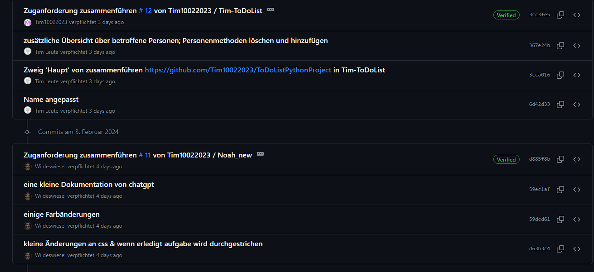
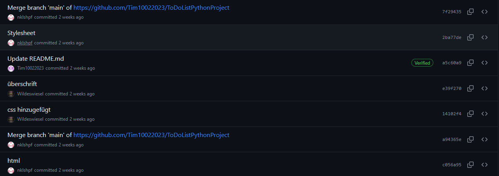

Hallo
Wir werden eine To-Do-Liste mit Python erstellen. Wir planen, einige nette Funktionen wie eine Erinnerung miteinzubinden und die wesentlichen Grundfunktionen aufzunehmen.
Habe Spaß!


# Durchführungskriterien Programmieren T3INF1004
In jedem Unterbereich werden die Punkte (gerne auch Links ins GIT) erklärt, wie das LO erklärt worden ist.
Alle Kriterien betreffen nur die Projektarbeit. Beweismaterial kommt aus dem Gruppenprojekt.

## FACHKOMPETENZ (40 Punkte)

# Die Studien kennen die Grundelemente der prozeduralen Programmierung. (10)
### Anwendung der Syntax: Deklaration von Funktionen und Routen
```Python
@ app.route ('/ login', Methoden = ['GET','POST'])
def login ():
 # Implementierung der Logik für den Login
```

### If-Modus
```Python
 If request.method == 'POST' and current_user.is_authenticated:
 task_content = request.form ["Inhalt"]
 task_date = request.form ["Datum"]
 assigned_to = request.form.get ('assigned_to')
 task_done = 'erledigt' in request.form
       
 new_task = Task (Inhalt = task_content, date = task_date, user_id = assigned_to, assigned_by_id = current_user.id, done = task_done)
 db.session.add (new_task)
 db.session.commit ()
```
### Variablen und Datentypen
```python
 task_content = request.form ["content"]
 task_date = request.form ["date"]
 task_done = 'done' in request.form
users = User.query.all ()
```


# Sie können die Syntax und Semantik von Python (10)
### ForSchleifen
```

    <!-- Anzeige der Task-Details hier -->

```
### Einsatz von Bibliotheken
```Python
from Flask import Flask, render_template, request, redirect, url_for, jsonify, flash
from flask_wtf import CSRFProtect 
from flask_login import LoginManager, login_user, logout_user, login_required, current_user
from werkzeug.security import genere_password_hash, check_password_hash
from models import db, Task, User, UserMixin
```

# Sie können ein großes Programm selbstverständlich, programmieren und auf Funktionen, die testen (Das Projekt im Team) (10)



# Sie kennen verschiedene Datenstrukturen und können diese bestimmte Welle werden. (10)
```Python 
 users = User.query.all ()
 task_content = []
 task_date = []
 task_done = false
 if request.method == 'POST' and current_user.is_authenticated:
 task_content = request.form ["Inhalt"]
 task_date = request.form ["Datum"]
 assigned_to = request.form.get ('assigned_to')
 task_done = 'erledigt' in request.form
 new_task = Task (content = task_content, date = task_date, user_id = assigned_to, assigned_by_id = current_user.id, done = task_done)
 db.session.add (new_task)
 db.session.commit () 
```
in diesem Teil des Codes werden die Daten, die im Popup-Fenster eingetrtagen worden sind, gelesen und in der Datenbank wird sie für die Homepage sicher sind.
Natürlich sind wir auch auf den Rest unserer Codes stolz.

## METHODENKOMPETENZ (10 Punkte)

# Die Studien können eine Entwicklungsumgebung werden um Programm zu stellen (10)
<!-- Beweise anbringen für Nutzen folgender Tools (können links, screenshots und screnncasts sein) -->
- [GIT](https://github.com/Tim10022023/ToDoListPythonProject)
- VS-Code
- DB-Browser für SQLite


## PERSONALE UND SOZIALE KOMPETENZ (20 Punkte)

# Die Studien können ihre Software kennen und verlassen. (5)
Noah: Probleme mit Github -> Branch konnte nicht gemerget werden (erklärt online mit Bildschirm)
Tim: Datenbank konnte nicht geleseen werden -> hat ``db.session.commit()`` gefehlt, Namensgebung in der DB angepasst
Niklas: Im HTML Problem dass die Popup-Seite nicht geschlossen wird wenn auf Save geklickt wird, wurde gelöst durch ``return "<script>window.opener.location.reload(); window.close();</script>"`` in der app.py datei

# Sie können existierenden Code analysieren und beurteilen. (5)
<!-- Pro Gruppe:You have critiqued another group project. Link to your critique here (another wiki page on your git) and link the project in the critique, use these evaluation criteria to critique the other project. Make sure they get a top grade after making the suggested changes -->
[Hier](https://github.com/Tim10022023/ToDoListPythonProject/wiki/Critique-for-the-group:-Weather%E2%80%90App) ein Link zu einer Kritik


# Sie können sich selbstständig in Entwicklungsumgebungen und Technologien einarbeiten und diese zur Programmierung und Fehlerbehebung einsetzen. (10)
- Flask (flask, flask_login)
- DB (flask_sqlalchemy)
- CSRFProtection (flask_wtf)
- Password-Hash (werkzeug.security)
<!-- Did you or your group get help from someone in the classroom (get a support message here from the person who helped you) -->


## ÜBERGREIFENDE HANDLUNGSKOMPETENZ (30 Punkte)

# Die Studierenden können eigenständig Problemstellungen der Praxis analysieren und zu deren Lösung Programme entwerfen (30)
<!-- Which parts of your project are you proud of and why (describe, analyse, link) -->
### Delete User
```python
@app.route('/delete_user', methods=['POST'])
def delete_user():
    user_ids = request.form.getlist('user_ids')
    for user_id in user_ids:
        user = User.query.get_or_404(user_id)
        if user == current_user:
            flash('Sie können sich nicht selbst löschen.')
        else:
            db.session.delete(user)
    db.session.commit()
    return redirect(url_for('homepage'))
```
### Ajax Code:
```javascript
function updateTaskStatus(checkbox) {
    const taskId = checkbox.getAttribute("data-task-id");
    const doneStatus = checkbox.checked;
    const csrfToken = document.querySelector('meta[name="csrf-token"]').getAttribute("content");
    const row = checkbox.closest("tr");
    const assignedById = row.getAttribute("data-assigned-by-id");
    const currentUserId = "{{ current_user.id }}";  // Stellen Sie sicher, dass dies korrekt ist

    // Entfernen Sie zunächst alle zustandsbezogenen Klassen
    row.classList.remove("task-done", "task-not-done-me", "task-not-done-not-me");

    // Dann fügen Sie die entsprechenden Klassen basierend auf dem Status und dem Ersteller der Aufgabe hinzu
    if (doneStatus) {
        row.classList.add("task-done");
    } else if (assignedById === currentUserId) {
        row.classList.add("task-not-done-me");
    } else {
        row.classList.add("task-not-done-not-me");
    }

    // Senden Sie die Änderung an den Server
    fetch(`/update_task_status/${taskId}`, {
        method: "POST",
        body: JSON.stringify({ done: doneStatus }),
        headers: {
            "Content-Type": "application/json",
            "X-CSRFToken": csrfToken,
        },
    }).then(response => {
        if (!response.ok) {
            console.error('Error updating task status');
        }
    });
}

```
<!-- Where were the problems with your implementation, timeline, functionality, team management (describe, analyse, reflect from past to future, link if relevant) -->

Problem: Benutzer können nur Engelgt werden allerdings nicht gelöscht werden
Problem: Kontrollkästchen werden nach neuladen immer wieder hergestellt

## Kenntisse in prozeduraler Programmierung:

# - Algorithmenbeschreibung
```Python
def check_due_date(task_date_string):
    if not task_date_string:  # Überprüft, ob der String leer ist
        return False  # oder eine andere geeignete Antwort
    task_date = datetime.strptime(task_date_string, "%Y-%m-%d").date()
    due_date = datetime.now().date() + timedelta(days=1)
    return task_date <= due_date
```

# - Datentypen
```Python
class Task(db.Model):
    id = db.Column(db.Integer, primary_key=True, autoincrement=True)
    content = db.Column(db.String(255), nullable=False)
    date = db.Column(db.String(255), nullable=False)
    done = db.Column(db.Boolean, default=False)
```

# - E / A-Operationen und Daceiverarbeitung
```Python
from models import db, Task, User, UserMixin

task_content = request.form ["Inhalt"]
```


# - Operatoren
```Python
 if request.method == 'POST' and current_user.is_authenticated: (z. 71)
 if Benutzer and check_password_hash (user.password_hash, Passwort): (z. 26)
 Task.query.filter((Task.user_id == user_id) | (Task.assigned_by_id == user_id)).delete()
```
# - Kontrollstrukturen
```Python
for task_id in task_ids:
 task = Task.query.get_or_404 (task_id)
```

# - Funktionen
```Python
@app.route('/')
@login_required
def homepage():
    tasks = Task.query.all()
    for task in tasks:
        task.due_soon = check_due_date(task.date)
    users = User.query.all()
    return render_template('index.html', tasks=tasks, users=users)
```

# - Stringverarbeitung

``return redirect (url_for ('homepage'))``


# - Strukturierte Datentype
```Python
class Task(db.Model):
    id = db.Column(db.Integer, primary_key=True, autoincrement=True)
    content = db.Column(db.String(255), nullable=False)
    date = db.Column(db.String(255), nullable=False)
    done = db.Column(db.Boolean, default=False)
    user_id = db.Column(db.Integer, db.ForeignKey('user.id'), nullable=False) 
    assigned_by_id = db.Column(db.Integer, db.ForeignKey('user.id'), nullable=True)  

    user = db.relationship('User', foreign_keys=[user_id], backref=db.backref('tasks', lazy=True))
    assigned_by = db.relationship('User', foreign_keys=[assigned_by_id], backref=db.backref('assigned_tasks', lazy=True))

```

